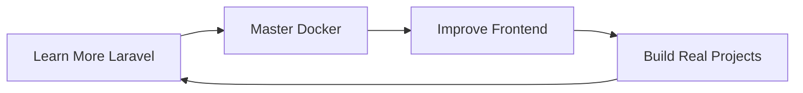

# 🌟 **Nguyễn Thị Thanh Thúy** 🌟

### 🚀 *Developer*

<div align="center">


```ascii
╔══════════════════════════════════════════════════════════════════╗
║    "Code with passion – Build with purpose"                     ║
╚══════════════════════════════════════════════════════════════════╝
```


</div>

---

## 🎓 **About Me**

<table>
<tr>
<td width="50%">

### 🏆 **Achievements**

* 🌟 Passionate Developer
* 🎓 Focus on modern web development
* 💡 Love solving real-world problems

### 🎯 **Current Focus**

* 🔧 Web Development
* 🌐 UI/UX Basics
* 📚 Backend Logic & API Development

</td>
<td width="50%">

### 🔥 **Quick Facts**

```yaml
name: "Nguyễn Thị Thanh Thúy"
role: "Developer"
skills: ["Laravel", "PHP", "MySQL", "Vue", "Docker"]
passion: "Learning & building new web applications"
motto: "Keep improving every single day"
```

</td>
</tr>
</table>

---

## 🛠️ **Technology Arsenal**

<div align="center">

### **Frontend Skills**


### **Backend Skills**


### **Database**


### **DevOps & Tools**


</div>

---

## 📊 **GitHub Analytics**

<div align="center">


### 🔥 **GitHub Streak**


</div>

---

## 🌟 **Future Goals**



* 🌱 Continue improving backend logic
* 🧠 Learn more advanced API design
* 🚀 Improve frontend with Vue.js

---

## 📬 **Connect With Me**

<div align="center">

<a href="#"></a> <a href="#"></a>

</div>

---

<div align="center">

### 🎯 **"Every day is a chance to become better"**


</div>


